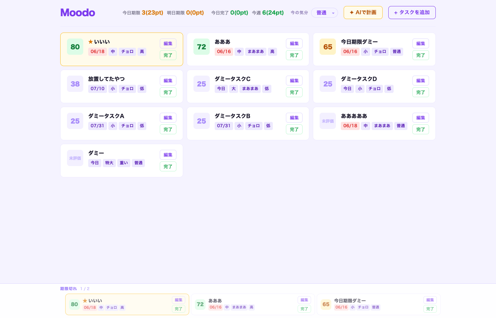
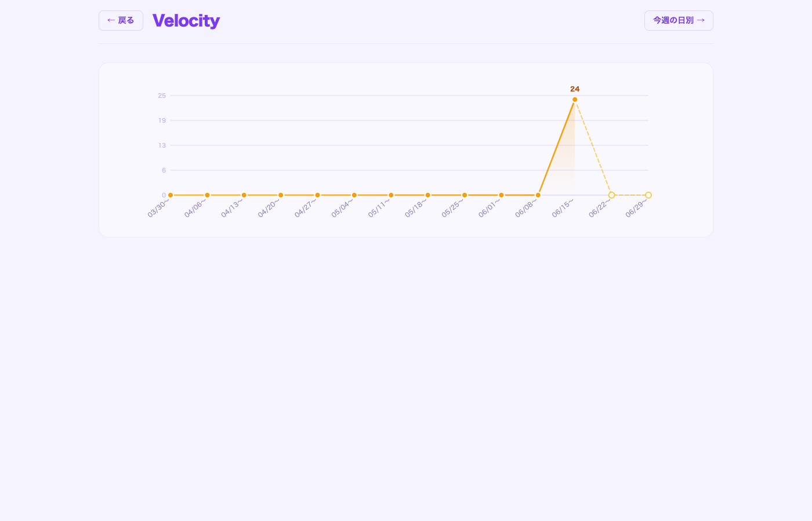
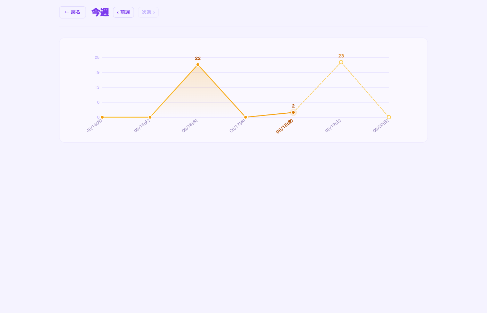

# Moodo

「今日はあんまりやる気ないな」「時間はあるけど重いタスクは無理」——そういう自分の状態を正直に入力すると、AI が今の気分に合ったタスクをおすすめしてくれる、気分優先のタスク管理アプリ。

ただのTODOリストではなく、**自分の気分を優先した人間らしい働き方**を支援することが目的。タスクに「作業見積もり・めんどくさレベル・期限・優先度」を設定し、今の気分を選ぶだけで、Claude がどのタスクに取り組むべきかをスコア（0〜100）で教えてくれる。



## 機能

### AI おすすめスコア

各タスクに 0〜100 のスコアが表示され、今の気分に合ったタスクが上位に来るよう並び替えられる。スコアは色で視覚的に区別できる。

- 緑（70以上）: 今すぐ取り組むのにぴったり
- オレンジ（40〜69）: まあまあいける
- グレー（39以下）: 今日は厳しいかも

### タスク属性

タスクには以下の属性を設定できる。

| 属性 | 選択肢 |
|---|---|
| 作業見積もり | 極小（1pt）/ 小（2pt）/ 中（5pt）/ 大（8pt）/ 特大（13pt） |
| めんどくさレベル | チョロ / まあまあ / 重い |
| 期限 | 日付（MMDD 4桁で入力） |
| 優先度 | 低 / 普通 / 高 |

### Moodoフラグ

スコアとは別に「今日これをやる」という自分の意志を反映できるフラグ。フラグONのタスクはカードが黄色になり★バッジが付く。

### ピックアップエリア

画面下部に「期限切れ」「今日期限」「積みタスク（作成から7日以上）」の見落としやすいタスクが自動で浮かび上がる。4.5秒ごとに自動でページングする。

### ベロシティ計測

完了タスクのポイントを週次・日別で集計してグラフ表示。自分のペースを把握することで、現実的なタスク計画を立てられる。




実線が実績、破線が期限ベースの予定ポイント。

### その他の操作

- **タスク完了**: 完了ボタンで `completed_tasks.json` に移動。完了時の気分・所要日数・期限との乖離が自動記録される
- **期限先送り**: 編集モーダルの「先送り」ボタンで期限を1日延ばす
- **タスク分割**: 「分割して追加」ボタンで大きなタスクを分割して登録できる
- **キーボード操作**: `Ctrl+Enter` でタスク追加モーダルを開く。モーダル内でも `Ctrl+Enter` で保存

## 起動方法

```bash
./start.sh
```

ブラウザで http://localhost:5173 を開く。`Ctrl+C` で両サーバーを同時に停止できる。

## AI評価の使い方

アプリで気分を設定したあと、Claude Code に一言お願いするだけでスコアが更新される。

```
タスク評価して
```

```
タスク整理して
```

```
何やろうか
```

```
今日何する？
```

Claude Code がプロジェクトルートの `score-prompt.md` の手順に従い、`backend/tasks.json` と `backend/mood.json` を読んでスコアを算出し、`tasks.json` を直接更新する。ブラウザをリロードすると反映される。

## 技術スタック

| レイヤー | 技術 |
|---|---|
| フロントエンド | React (Vite) + TypeScript |
| バックエンド | FastAPI (Python) + uv |
| データ保存 | `tasks.json` / `mood.json` / `completed_tasks.json`（ファイル管理） |
